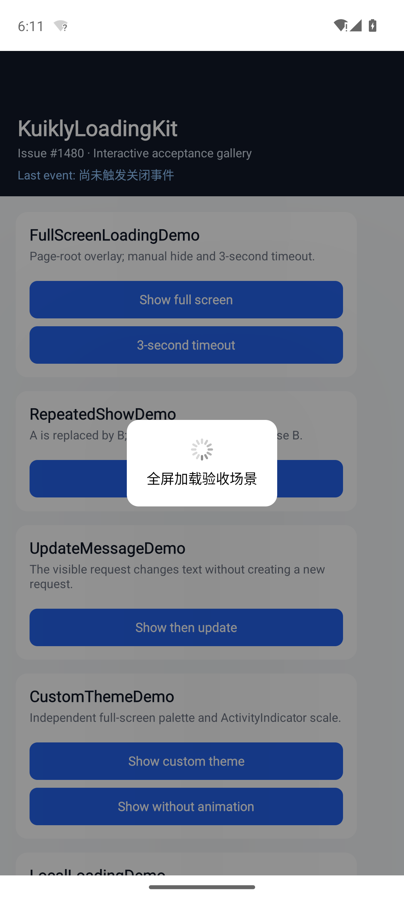
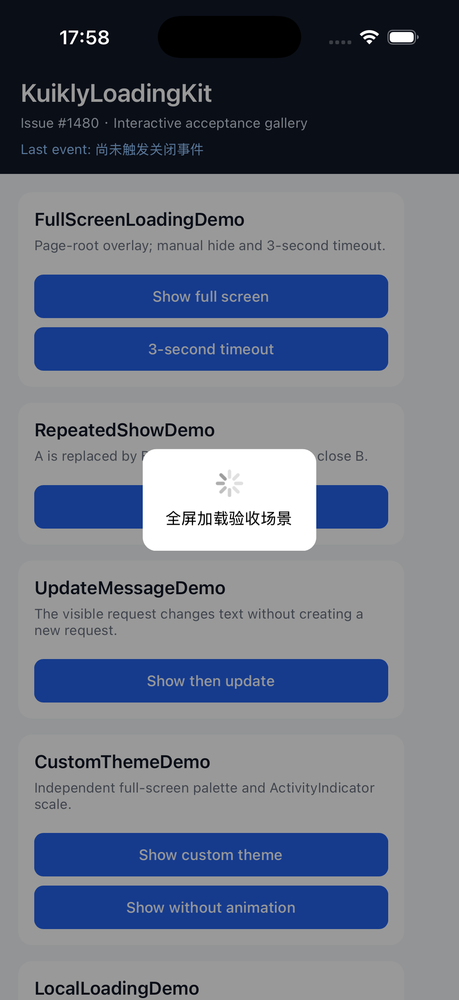
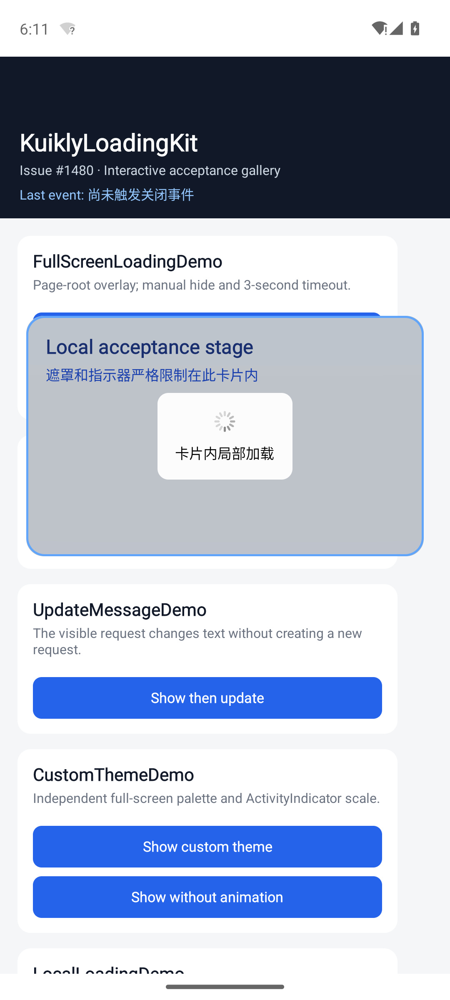
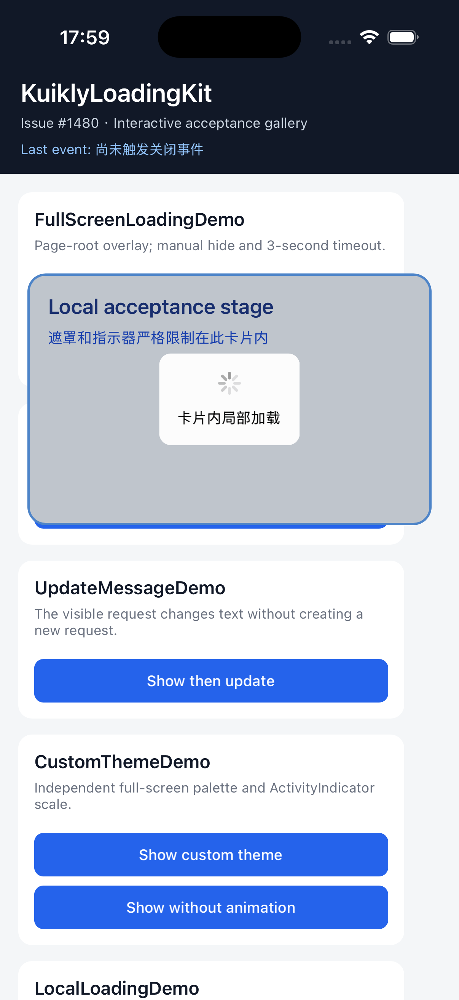

# KuiklyLoadingKit

English | [简体中文](README.md)

A Kotlin Multiplatform loading-overlay component built on KuiklyUI, with full-screen and local overlays, cancellable timeouts, an imperative controller, and a declarative DSL. Android and iOS example apps are included.

The component was developed for [Tencent-TDS/KuiklyUI ecosystem task #1480](https://github.com/Tencent-TDS/KuiklyUI/issues/1480). An upstream project collaborator [acknowledged completion](https://github.com/Tencent-TDS/KuiklyUI/issues/1480#issuecomment-5192793318). The component and examples are delivered in this repository.

## Preview

| Android | iOS |
| --- | --- |
|  |  |
|  |  |

More screenshots: [artifact index](artifacts/README.md).

## Features

- Full-screen and parent-container overlays.
- Kuikly `ActivityIndicator` with configurable message, colors, padding, corner radius and indicator scale.
- `show`, `hide`, `updateMessage` and `showDefaults` controller methods.
- Cancellable timeouts; replacing a request invalidates its previous timer.
- Separate themes for full-screen and local modes.
- Touch interception and fade-in/fade-out animation.
- Cleanup when a page unloads or is destroyed.
- Pure Kotlin state-machine and controller tests.

## Basic usage

Create a controller and declare an overlay in the page's root container:

```kotlin
private val loadingController = LoadingController()

LoadingOverlay(loadingController) {
    attr {
        mode = LoadingMode.FULL_SCREEN
        defaultMessage = "Loading..."
        blockTouch = true
    }
    event {
        onDismiss { reason ->
            println("dismissed: $reason")
        }
    }
}
```

Show, update and dismiss it:

```kotlin
loadingController.show(
    message = "Fetching data",
    timeoutMillis = 10_000L,
    blockTouch = true,
)
loadingController.updateMessage("Processing results")
loadingController.hide()
```

A `null`, zero or negative `timeoutMillis` disables automatic dismissal. Calling `hide()` repeatedly while hidden does not emit duplicate dismiss callbacks.

### Local overlay

Place the overlay inside the container it should cover:

```kotlin
View {
    attr {
        height(180f)
        positionRelative()
    }

    // Container content

    LoadingOverlay(localController) {
        attr {
            mode = LoadingMode.LOCAL
        }
    }
}
```

The component uses `absolutePositionAllZero()` to fill its actual parent bounds.

### Defaults

Use `showDefaults()` to apply defaults declared in the DSL:

```kotlin
LoadingOverlay(loadingController) {
    attr {
        defaultMessage = "Syncing..."
        defaultTimeoutMillis = 3_000L
    }
}
loadingController.showDefaults()
```

A regular `show()` uses its supplied arguments and does not implicitly apply `defaultTimeoutMillis`. See the [API reference](docs/API.md) for themes, animation configuration and callback details.

## Request lifecycle

When a new `show()` replaces an active request, the old request receives one `REPLACED` callback and its timer is cancelled. Timer callbacks also check a generation identifier so that a stale callback cannot close a newer request.

Dismiss reasons are `MANUAL`, `TIMEOUT`, `REPLACED` and `DESTROYED`. The [state-machine documentation](docs/STATE_MACHINE.md) describes transitions and callback behavior.

## Repository layout

```text
loading-kit/  Component, state machine, controller and tests
shared/       Kuikly demo pages and iOS framework
androidApp/   Android example host
iosApp/       iOS example host
docs/         API, architecture, build and validation notes
artifacts/    Android/iOS screenshots
```

## Build baseline

The documented build uses **JDK 17**, **Gradle 8.7**, **Kotlin 2.1.21** and **Kuikly 2.23.2-2.1.21**. Configure JDK 17 and the Android SDK for your machine; iOS builds also require macOS, Xcode and CocoaPods.

From the repository root:

```bash
./gradlew :loading-kit:allTests
./gradlew :androidApp:assembleDebug
./gradlew :shared:compileTestKotlinIosSimulatorArm64
./gradlew :shared:linkPodDebugFrameworkIosSimulatorArm64
```

See the [build baseline](docs/BUILD_BASELINE.md) for environment setup and the [iOS host guide](iosApp/README.md) for CocoaPods and Xcode steps. Detailed documents are currently in Chinese; API names and commands are preserved.

## Recorded validation

The [validation record from 23 July 2026](docs/VALIDATION.md) documents these results:

| Check | Recorded result |
| --- | --- |
| State-machine and controller tests | 21 passed |
| Android debug APK | Built |
| Android 14 / API 34 ARM64 emulator | Example app ran |
| iOS Simulator ARM64 framework | Built |
| CocoaPods integration | Passed |
| iPhone 17 Pro / iOS 26.0 simulator | Example app ran |

These entries describe the recorded environment. The linked record contains commands and screenshot references.

## Documentation

- [API](docs/API.md)
- [Architecture](docs/ARCHITECTURE.md)
- [State machine](docs/STATE_MACHINE.md)
- [Build baseline](docs/BUILD_BASELINE.md)
- [Validation record](docs/VALIDATION.md)
- [Task #1480 checklist](docs/ISSUE_1480_CHECKLIST.md)
- [References](docs/REFERENCES.md)

## Current scope

Source integration is provided; there is no Maven Central or CocoaPods Specs package. Screenshots cover the main static states and timeout dismissal, with no animation recording. H5 is outside the current implementation.

## License

[Apache License 2.0](LICENSE).
