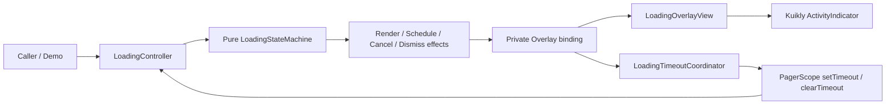

# Architecture

## Boundaries

### Pure common code

`loading-kit/src/commonMain` contains request types, the state machine,
Controller, scheduler abstraction, and animation configuration. It does not
depend on Kuikly or platform renderers and therefore runs under JVM tests.

### Kuikly UI code

`loading-kit/src/kuiklyMain` depends on Kuikly `core` and `core-annotations`.
Android and all iOS targets depend on this source set. It provides themes,
Compose Attr/Event, the Overlay view, and the Kuikly timer adapter.

The public View does not expose internal snapshots or binding types. A private
adapter translates Controller effects into reactive view state.

### Demo code

`shared` owns `LoadingGalleryPage`, KSP page registration, and the iOS
CocoaPods framework. It depends on `loading-kit`, not the reverse.

### Platform hosts

`androidApp` contains a minimal `KuiklyRenderViewBaseDelegator` Activity.
`iosApp` contains a minimal SwiftUI wrapper and
`KuiklyRenderViewControllerBaseDelegator`.

## Source-set decision

Kuikly core does not publish a conventional JVM variant suitable for the
desktop test target. Pure logic therefore remains in `commonMain`, while
Kuikly UI lives in a dedicated `kuiklyMain` source set used only by Android
and iOS. This preserves JVM testability without vendoring or stubbing Kuikly.

## Rendering decision

The Overlay stays attached while hidden, with opacity zero and touch disabled.
This lets fade-out presentation complete without creating animation-owned
states. The state machine remains the only authority for visible/hidden and
dismissal semantics.

## Timeout safety

Timeout safety has two layers:

1. `clearTimeout` physically removes the current Kuikly callback when possible.
2. Every callback carries a monotonically increasing generation, so an old
   callback is ignored even if physical cancellation is unavailable or races.

Timeouts larger than Kuikly's `Int` timer limit are split into sequential
chunks. Controller deadlines use a monotonic clock, so View rebinding schedules
only the remaining duration.

This is also exercised with a deterministic ManualScheduler in JVM tests.
